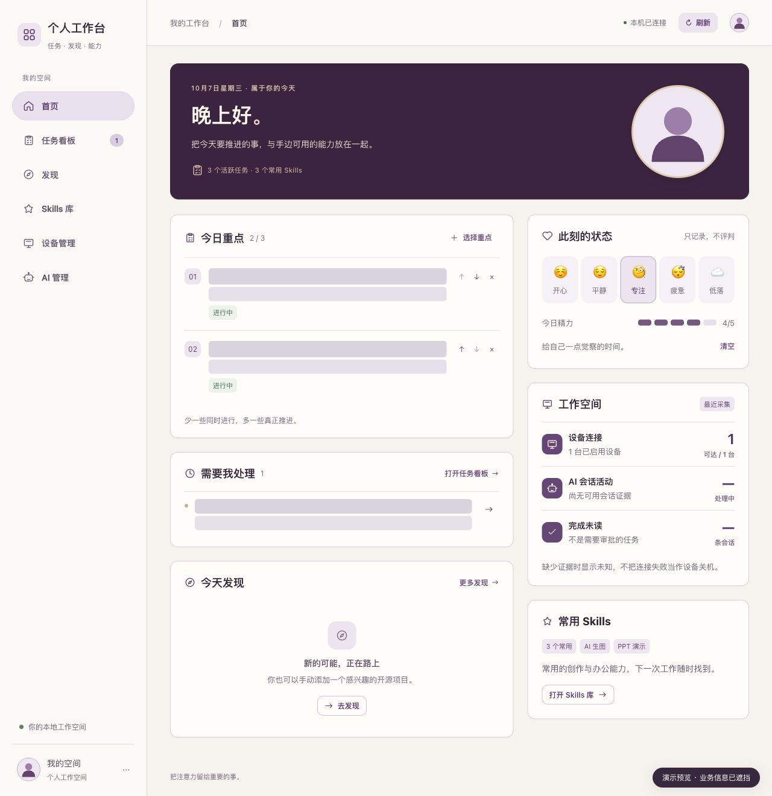
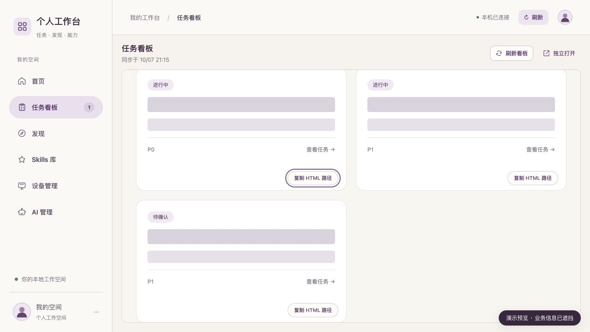
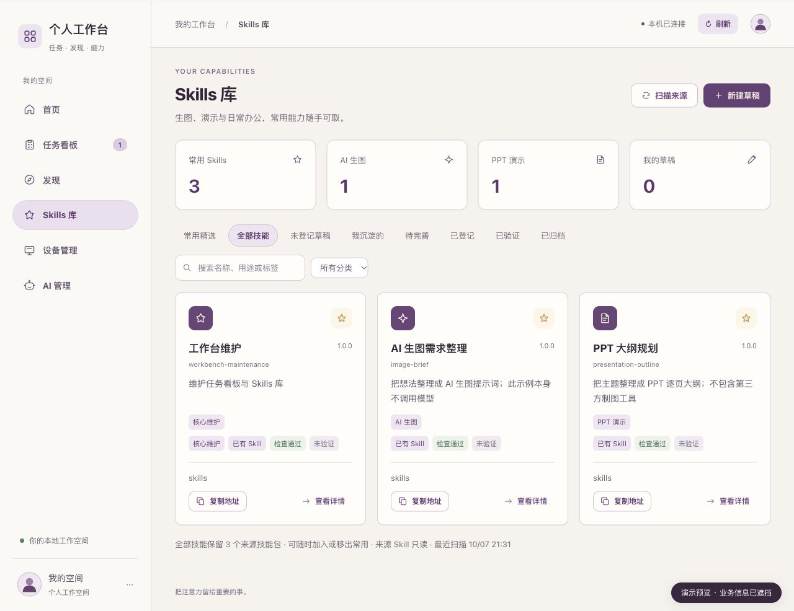
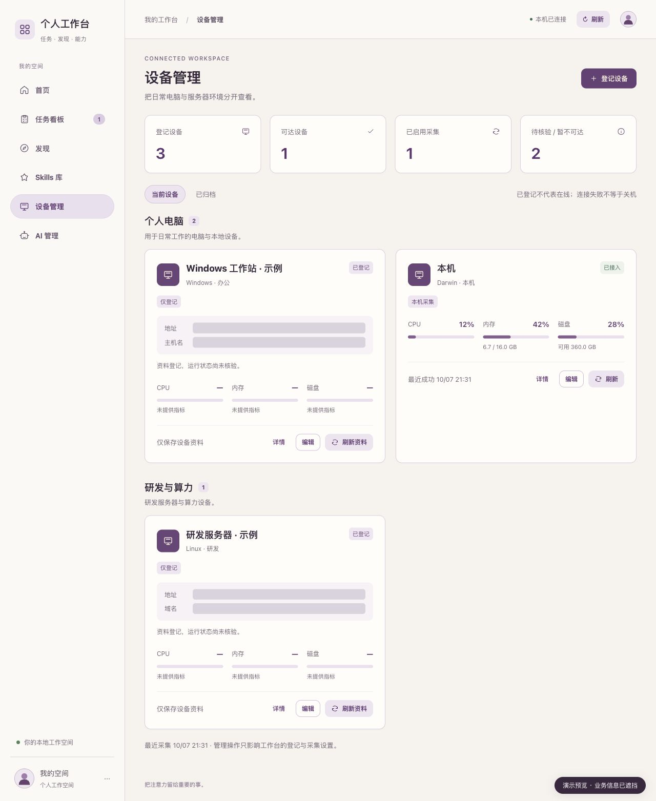

# Personal AI Workbench · 个人 AI 工作台

把任务、常用 Skills、AI 资讯和设备状态放进一个本地工作空间。用任务 HTML 和 Skill 入口文件，把工作交给能访问同一文件系统的 AI。

**本地优先 · 单人使用 · 无云端账户 · Python + 原生前端 · MIT**

## 界面预览

以下截图来自隔离的演示环境，任务内容与设备地址已用实心遮挡。未使用真实任务、设备清单、私人 Skills 或个人头像；点击图片可查看大图。

| 首页 · 今日重点与心情 | 任务看板 · 直接复制 HTML 路径 |
| --- | --- |
| [](docs/screenshots/home.jpg) | [](docs/screenshots/tasks.jpg) |
| **Skills 库 · 常用能力与一键复制** | **设备管理 · 资源状态与环境分组** |
| [](docs/screenshots/skills.jpg) | [](docs/screenshots/devices.jpg) |

## 可以做什么

| 页面 | 功能 |
| --- | --- |
| 首页 | 今天的日期、心情、重点任务、常用能力与来源状态 |
| 任务 | 接入已有看板；每个任务有独立详情页；直接在卡片复制本地 HTML 绝对路径，也可下载文件或复制启动说明 |
| 发现 | 默认 10 条 AIHOT 资讯与查看更多、按今日新增 Star 排序的 GitHub 热门项目、直接展示模型排行榜 |
| Skills 库 | 收藏常用能力、复制 SKILL.md 绝对路径、检查引用、管理自己的草稿与版本、导出安全包、记录实际验证结果 |
| 设备管理 | 本机 CPU / 内存 / 磁盘；手动登记设备；明确配置后可用固定 SSH 探针读取远端资源指标 |
| AI 管理 | 按设备与角色组织 AI；区分进程状态、来源状态和活动证据；状态采集默认关闭 |

### 任务与 Skills 都是可交接的入口

任务列表保留原看板作为来源。点击任务会打开独立页，卡片上的“复制 HTML 路径”会生成最新快照，便于交给另一个本地 AI 继续工作。Skills 的“复制地址”给出实际入口文件的位置；跨电脑分享时，改用下载任务 HTML 或导出 Skill 包。

绝对路径只对能访问该磁盘的工具有意义。它不会自动把文件上传给同事或 AI，也不会自动安装、执行 Skill。

## 快速开始

支持 macOS / Linux，Python 3.9+。任务快照使用 POSIX 文件系统保护接口，暂不支持 Windows 直接运行服务；可读取已配置 Windows 设备的 SSH 指标。

```bash
git clone https://github.com/bushushu2333/personal-ai-workbench.git
cd personal-ai-workbench
python3 -m venv .venv
source .venv/bin/activate
pip install -r requirements.txt
python server.py
```

浏览器打开 **http://127.0.0.1:4186/**。仓库附带 3 个虚构任务、3 个原创示例 Skills 和通用图标，首次打开即可体验；它们不是作者的真实工作资料。

macOS 也可运行 `zsh 打开个人工作台.command`，初始化依赖并打开浏览器。后台进程仅由本项目的服务脚本管理：

```bash
.venv/bin/python service.py start
.venv/bin/python service.py status
.venv/bin/python service.py stop
```

端口冲突时手动使用 `python server.py --port 4187`。服务脚本固定使用 4186；任务导出的启动说明也以 4186 为默认工作台地址。

## 接入自己的资料

先复制 `config.example.json` 为 **config.local.json**。该文件被 Git 忽略，修改后重启工作台。

```json
{
  "task_board_root": "private/task-board",
  "skills_roots": ["private/skills"],
  "enable_ai": false,
  "bridge_url": "http://127.0.0.1:8791",
  "remote_devices": []
}
```

相对路径以项目目录为基准，也支持本机绝对路径。上面的 private 路径需要自行创建；整个 private 目录均被 Git 忽略。可以保持示例配置，只逐项替换需要接入的来源。真实任务和 Skills 请放在 private 或仓库外，不要覆盖准备公开提交的 examples。

### 接入已有任务看板

`task_board_root` 指向包含 index.html 和 tasks-data 的目录。index.html 必须含 `script#task-data[type="application/json"]` 的任务数组；`data-task` 卡片可获得独立页与复制按钮。任务字段、来源边界与页面资源白名单见 [看板接入说明](docs/task-board.md)。

工作台只读已有任务档案和生成页面。更新任务后，运行原看板自己的生成器，再刷新工作台；不会替你运行未知生成器。附带示例的生成命令为：

```bash
python examples/task-board/build.py
```

该命令只重建附带示例。Skills 库中置顶的“工作台维护”示例提供维护任务与 Skills 的步骤。

### Skills

只扫描配置中列出的目录，不默认扫描 Home 下的任何 AI 工具目录。来源包始终只读。新草稿、修订、检查与验证记录写入本地 data。默认只收藏 3 个演示能力；把自己的常用能力加入配置，再点“加入常用”即可。

### 设备与 AI 状态

默认只采集本机资源，不配置任何远端地址。远端 SSH 采集须在本地配置中显式登记，例如：

```json
{
  "remote_devices": [
    {"id": "demo-server", "name": "示例服务器", "ssh_alias": "workbench-example", "host": "192.0.2.10", "system": "Linux", "enabled": false}
  ]
}
```

192.0.2.10 是文档示例地址。请在本地 SSH 配置中设置自己的别名、认证与已知主机，核对目标后才启用采集。应用会核对解析后的目标，并拒绝跳板、代理和预设远程命令；仅运行固定资源探针，不提供远程终端、重启或部署功能。

AI 列表初始为暂停。页面上明确启用后，应用才读取进程状态及所选来源。Codex / ZCode / Kimi 活动需要另外运行兼容的本地 bridge，项目不附带 bridge；Hermes 读取本机 gateway_state.json。bridge 仅允许本机地址。来源不可用或过期时显示未知，不生成虚假的在线或任务计数。来源协议见 [AI 接入说明](docs/ai-sources.md)。`enable_ai` 仅决定新数据目录首次初始化时的开关，后续由页面管理已存的开关。

## 隐私与联网

- 真实任务、技能内容、设备清单、活动快照、心情、收藏、配置与备份只保存在本机；应用没有分析统计、遥测或云端同步代码。
- 发现页会从 **aihot.news、github.com、api.github.com** 读取公共数据。请求不携带任务、Skills、设备信息、兴趣标签或 API 凭据；对方仍可看到标准网络连接信息。外部链接由浏览器直接打开。
- AI 与远端来源默认不采集，只有你配置或启用后才读取。
- 服务绑定 127.0.0.1，并校验 Host、Origin 和修改请求标识；没有多用户认证，不适合直接暴露到公网或局域网。
- `.gitignore` 排除运行数据、私有配置、导出文件、日志、密钥与本地资源。公开版本使用全新 Git 历史，不附带真实头像、含私人数据的截图或旧备份；只附审核过的演示配图。
- 本地任务 HTML 与 Skill 导出可能包含你自己的业务内容和绝对路径。发送给其他人之前检查文件；凭据检测只是辅助，不能替代人工检查。

更多边界见 [PRIVACY.md](PRIVACY.md)。资讯与排行榜均保留来源链接；网站接口变化、限流或不可用时保留上次成功快照并显示来源状态。模型榜来自 AIHOT 公共榜页解析，并不是所有模型平台的统一官方 API。

## 开发与检查

```bash
pip install -r requirements-dev.txt
python -m pytest -q
python scripts/privacy_check.py
```

隐私检查读取 Git 暂存区内容并拒绝运行数据、可疑凭据和未审核的文件类型。首次提交前先 `git add` 再检查；检查通过不代表可以跳过代码与内容审阅。CI 同时运行测试与检查。

## 目录

```text
server.py             本机 HTTP/API 与请求边界
workbench/            SQLite、来源适配、任务交接与 Skills 管理
static/               原生 HTML / CSS / JavaScript
examples/             虚构看板与原创示例 Skills
docs/                 接入约定
tests/                功能、只读边界与隐私默认值检查
scripts/              发布隐私检查
data/                 运行时生成，永不提交
config.local.json     用户配置，永不提交
```

## License

[MIT](LICENSE)。项目不捆绑第三方 Skills 或其他开源看板的源码；公共数据的归属与使用条件仍由各来源决定。
